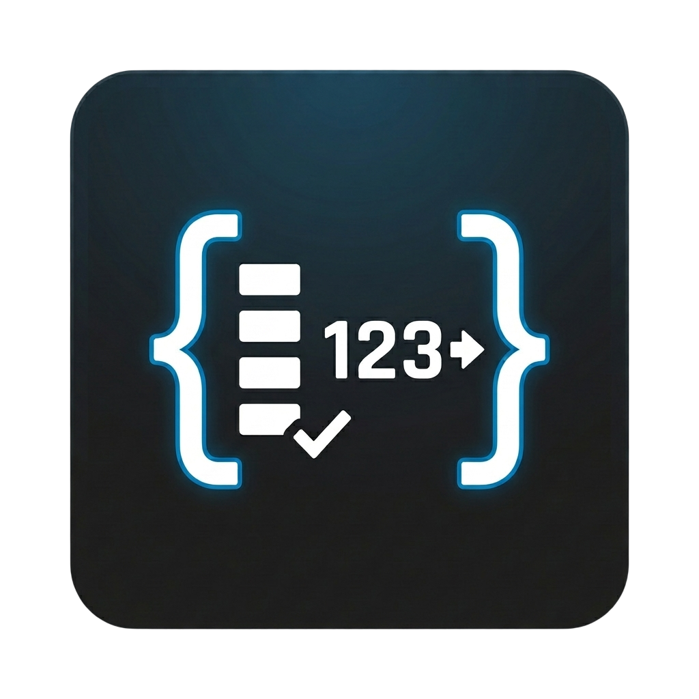

# VS Code Token Counter



A VS Code extension that counts tokens for the active editor using OpenAI `tiktoken` and shows the result in the status bar.

## What This Project Does

`vscode-tokencount` helps you estimate prompt size while writing code or text by showing live token counts in VS Code.

- Shows `Tokens: <count>` in the status bar for the active editor.
- Recomputes count when you type, switch editors, save files, or change extension settings.
- Supports two counting sources:
  - `encoding` mode (direct tiktoken encoding, such as `cl100k_base`)
  - `model` mode (model mapping, such as `gpt-4o-mini`)
- Uses adaptive debounce for large files to keep the UI responsive.
- Optionally includes untitled files and can render on the left or right side of the status bar.
- Provides a detailed breakdown (tokens, characters, lines, selected source, resolved encoding) in an output panel.

Only file-backed documents (`file:`) are counted by default, plus untitled documents when enabled. Non-file schemes (for example `git:` virtual documents) are intentionally skipped.

## Commands

- `Token Count: Choose Counter Source` (`tokenCount.pickCounterSource`)
  - Opens a picker to switch between supported encodings and models.
- `Token Count: Toggle Detailed Information` (`tokenCount.toggleDetails`)
  - Shows or hides the detailed token info panel.

You can also click the status bar item to open the source picker.

## Configuration

All settings live under the `tokenCount` section:

- `tokenCount.countingMode`: `encoding` or `model` (default: `encoding`)
- `tokenCount.encoding`: one of `gpt2`, `r50k_base`, `p50k_base`, `p50k_edit`, `cl100k_base`, `o200k_base` (default: `cl100k_base`)
- `tokenCount.model`: one of `gpt-4o-mini`, `gpt-4o`, `gpt-4.1-mini`, `gpt-4.1`, `o3-mini`, `o4-mini`, `gpt-5-mini`, `gpt-5` (default: `gpt-4o-mini`)
- `tokenCount.displayOnRightSide`: show status bar item on the right (default: `false`)
- `tokenCount.showForUntitled`: include untitled editors (default: `true`)
- `tokenCount.debounceMs`: debounce for normal files in ms (default: `120`)
- `tokenCount.largeFileDebounceMs`: debounce for large files in ms (default: `450`)
- `tokenCount.largeFileCharThreshold`: character threshold for large-file debounce (default: `60000`)

## Development

```bash
npm install
npm run compile
npm run lint
npm test
```

Run `F5` in VS Code to launch an Extension Development Host.

## Packaging and Publishing

```bash
npm run package:vsix
npm run package:pre-release
npm run publish:vsce
npm run publish:patch
npm run publish:minor
npm run publish:major
```
